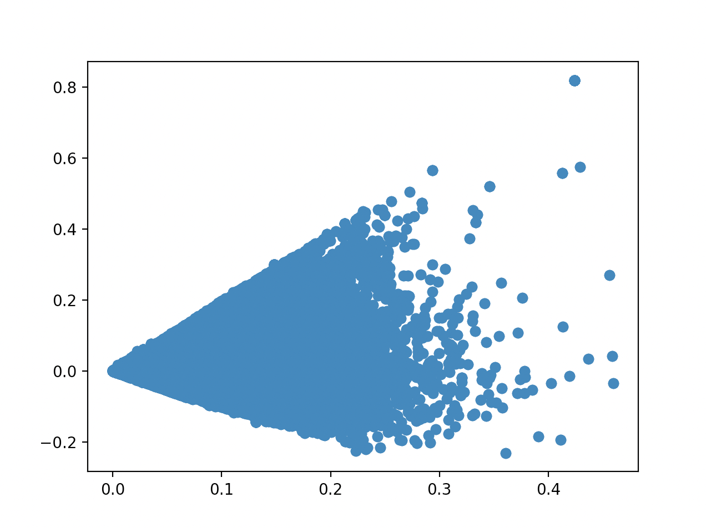
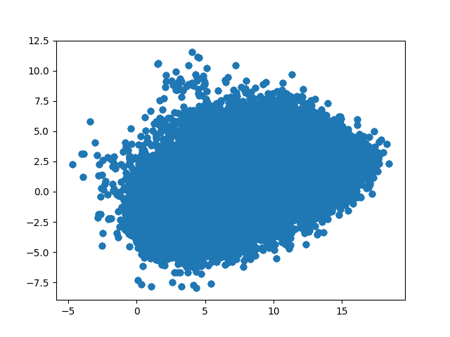
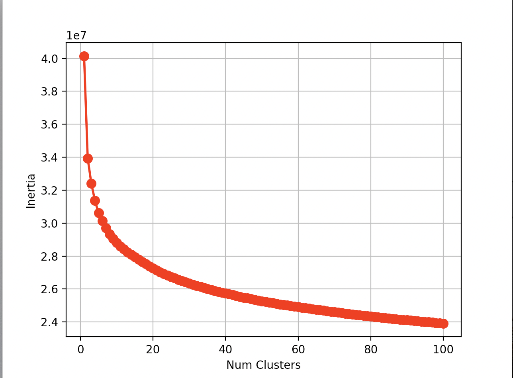
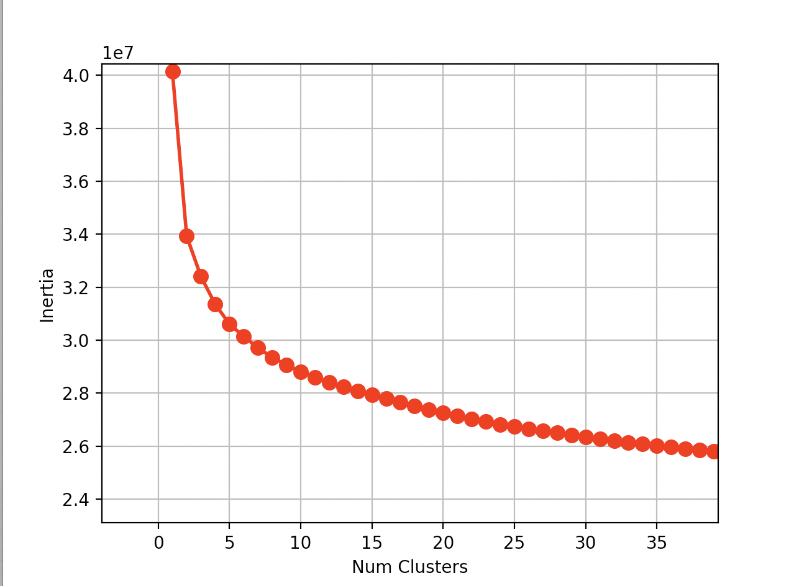
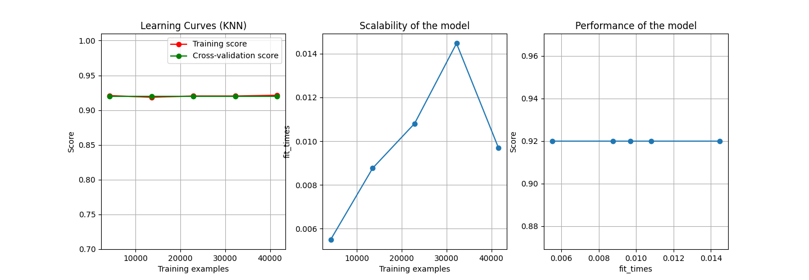
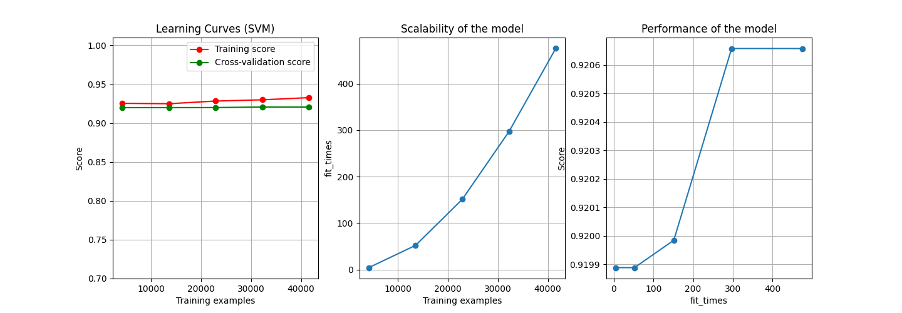
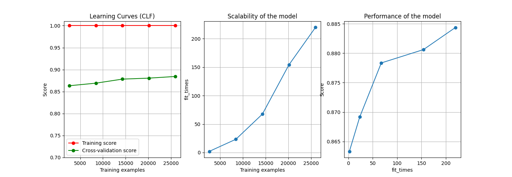

## Clustering del Dataset en busca de alguna estructura clara en el mismo

### Resumen

Para desplegar un sitio interactivo donde se mezclen texto reales de las redes sociales con textos generados por una inteligencia artificial, se desarrollo un Sistema de Recuperación de Información usando el mismo dataset de la IA. Para evaluar el rendimiento de dicho SRI, se necesita un mecanismo de pueda aprender los distintos grupos semánticos que forman parte del dataset y que además sea capaz de clasificar las distintas consultas realizadas, de esta manera se autogenerarian colecciones de prueba que permitiría clasificar al SRI.

### Introducción

Los Sistemas de Recuperación de Información son programas que se encargan de dada una consulta particular y un corpus de documentos, listar la serie de documentos que pueden resultar relevantes para dicha consulta. La recuperación de información es una de las ramas de la computación más estudiada, pues su problemas principal es de interés de muchas esferas de la sociedad, más aun con el crecimiento exponencial de los distintos contenidos digitales. Uno de los problemas que presenta estos sistemas es que la definición de relevancia es altamente subjetiva y contextual, por lo que probar el buen funcionamiento de estos software depende de el esfuerzo de expertos que visualicen todos los documentos del corpus y clasifique en relevantes o no, según un listado de consultas definidas, formando así un set de prueba. Aunque existe varios set de prueba en internet la gran mayoría son de documentos en ingles y algunos están compuestos de una cierta cantidad finita de temas principales. En el caso del dataset que interesa a esta investigación los documentos son en español y la lista de tema es totalmente aleatoria. La carencia de expertos y tiempo para clasificar y documentar dicho dataset, se necesita idear una manera automática de construir selecciones de prueba para evaluar el SRI.

Para dar respuesta a esta situación problemática, se plantea un estudio no supervisado del dataset en búsqueda de alguna estructura que pueda ser interpretada semánticamente y mediante la cual se pueda clasificar o generar una lista de consultas. De encontrarse dicho patrón se podría evaluar el SRI a partir de las distintas consulta revisando cuantos de los documentos que pertenece al mismo grupo el SRI recupera. Para encontrar dicha estructura, de existir, iniciamos vectorizando el dataset a una escala prudente para evitar la "Maldición de la Dimensionalidad", posteriormente se entrenarán algunos modelos de cluster para realizar un proceso final de selección de modelos según la efectividad de los mismo al detectar subgrupos dentro del dataset.

### Vectorizacion de Documentos

En esta face de la investigación el objetivo principal es encontrar un mecanismo mediante el que se pueda comprimir toda la información semántica de cada uno de los documentos en un vector de una dimension no muy grande. Para resolver este problema se tuvieron en cuenta tres técnicas principales, transformaciones tfidf de todo el dataset, vectorización a partir de la librería de _Python_ `spacy` o definir un autoencoder de los documentos para luego de entrenar al mismo transformar el dataset mediante la subred de encoder.

#### Transformaciones TfIdf

Este es un proceso bastante sencillo y muy utilizado en el procesamiento de lenguaje natural, sobre todo en mucho de los modelos que se usa para la recuperación de información. Este enfoque tiene como desventaja que la dimension de los vectores resultantes tiene dimension igual a la cantidad de términos distintos que se reconocen en el dataset, por muchas optimizaciones que se incluyan en el reconocimiento de los términos, esto sería una dimension demasiado grande para aplicar algoritmos basado en el concepto de distancia. Para reducir el tamaño de estos vectores, a la salida de la vectorización tfidf se le aplico la técnica de reducción de dimensiones `SVD`, para este ultimo paso se fijo una dimension de 96 features. Finalmente se aplico otra reducción de dimensiones a dimension 2 para realizar la visualización de dataset vectorizado, visualización en la que no se pudo apreciar una estructura clara en dicha dimensión sino que se muestra como un único grupo muy homogéneo.



#### Vectorización de Spacy

Spacy es una de las librerías de procesamiento de lenguaje natural más usada en la actualidad y entre su gran lista de bondades incluye la capacidad de transformar un texto en un vector. Se intento investigar que tipo de transformaciones son las que realiza, pero no fue encontrada esta información en su [página oficial](spacy.io), analizando el comportamiento de la herramienta y su lista de feature los autores presumen que es probable que se trate de un embbeding tipo `doc2vec`. Una vez obtenidos todos los resultados de la transformación se realizo el mismo procesos que en transformaciones anteriores para lograr una visualización del dataset en dos dimensiones, en esta ocupación al igual que las anteriores a simple vista solo se nota un solo grupo homogéneo



#### Vectorización Mediante AutoEncoder

Para la llevar a cabo este enfoque se definió una red neuronal siguiendo el patrón autoencoder, dicho modelo perteneces a la subfamilia de los algoritmos supervisados de la amplia lista de los algoritmos de mundo de `Machine Learning`, en este caso el dataset esta compuesto por la lista de términos de cada documento y el resultado correcto contra el que el modelo comparará durante el entrenamiento para aprender de sus errores es este mismo vector, buscando que la red aprenda a identificar cada uno de los documentos del dataset. El modelo definido se muestra a continuación, pero en este enfoque no se lograron resultado debido a la falta de potencia de computo en el equipo de investigación.

```python
    encoder_inputs = Input(shape=(maxlen,), name='Encoder-Input')
    emb_layer = Embedding(num_words, embed_dim, input_length=maxlen,
                          name='Body-Word-Embedding', mask_zero=False)
    x = emb_layer(encoder_inputs)
    state_h = Bidirectional(
        LSTM(embed_dim, activation='relu', name='Encoder-Last-LSTM'))(x)
    encoder_model = Model(inputs=encoder_inputs,
                          outputs=state_h, name='Encoder-Model')
    seq2seq_encoder_out = encoder_model(encoder_inputs)

    decoded = RepeatVector(maxlen)(seq2seq_encoder_out)
    decoder_lstm = Bidirectional(LSTM(embed_dim, name='Decoder-LSTM-before'))
    decoder_lstm_output = decoder_lstm(decoded)
    decoder_dense = Dense(maxlen, activation='softmax',
                          name='Final-Output-Dense-before')
    decoder_outputs = decoder_dense(decoder_lstm_output)
    seq2seq_Model = Model(encoder_inputs, decoder_outputs)
```

### Búsqueda de Estructura en el Dataset

Para encontrar alguna estructura en los datos se realizaron varios análisis al dataset en cuestión; para estos análisis se eligió la vectorización de `spacy` la cual aparentemente es la que mejor distribuye los vectores en el espacio, por lo que se supone que se más probable encontrar alguna estructura en dicho espacio. La investigación comenzó realizando un análisis de inercia de los centroides de un modelo _Kmeans_, con la esperanza de encontrar alguna señal evidente de la cantidad de clusters en la data como puedes ser 'la medida del codo'. A continuación se muestra las gráficas obtenidas, en las misma la pendientes que se aprecia son notablemente suaves, razón por la que en esta linea de investigación no tubo resultados relevantes para el resultado final.




El siguiente enfoque que se probó fue entrenar modelos con enfoque aglomerativos en búsqueda de algún tipo de hierarquía en los datos. En el desarrollo de estos modelos se encontraron dificultades con el tiempo que se demoraban en el proceso de entrenamiento, pues como el dataset es extremadamente grande y estos algoritmos presentar un costo temporal aproximado al cuadrado del tamaño del dataset entonces los mismo se demoraban días en finalizar. Para poder estimar los resultados que se pudieran obtener de este proceso sin esperar por el mismo se redujo la dimension del corpus tomando aleatoriamente subpedazos del dataset original, con este se entrenaron los modelos aglomerativos y luego con los clusters encontrados en este entrenamiento se estrenaron varios clasificadores para estimar las etiquetas correspondientes al resto del corpus. Entre los clasificadores seleccionados para la buscar el que mejor se ajuste a los datos se tuvieron en cuenta los algoritmos `KNN`, `SVM` y `Arboles de Deserción`, a continuación se muestran las gráficas de aprendizaje de estos modelos donde se puede apreciar que todos presentan un alto porcentaje de acierto en la predicción.





El problema con estos modelos es que el resultado del procesos de aglomeración detecto un cluster muy denso y otros muy poco densos con lo cual un clasificador que siempre responda la clasificación del cluster más denso, será un clasificador con una alto porcentaje de acierto pero que generaliza mal.

### Conclusiones

Los enfoques seleccionados no encontraros alguna estructura clara dentro del dataset que permita evaluar el SRI en cuestión. Ya que los enfoques automáticos no pudieron lograr el objetivo el siguiente paso debería ser probar enfoques semiautomático para unir algunos expertos del idioma junto con algunos modelos de clasificación.

### Referencias

1 - Wikipedia
